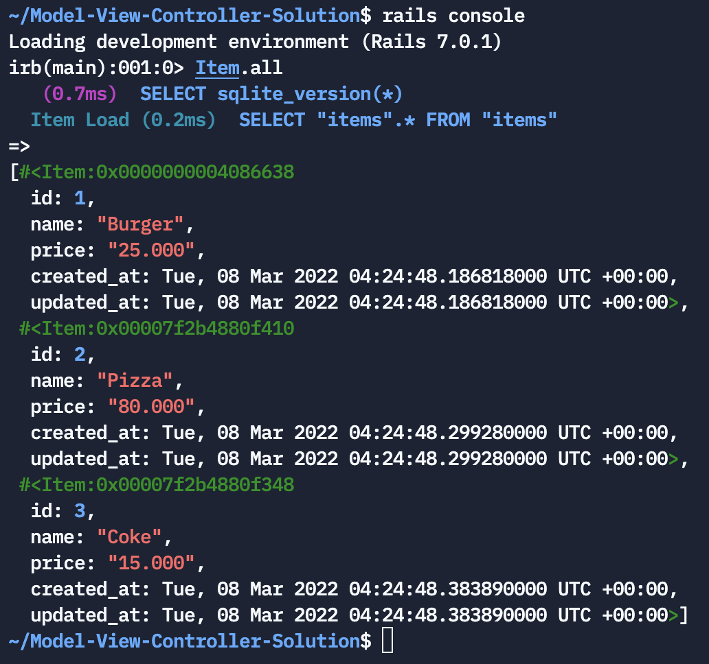

# Web Framework

## What are web frameworks and why do you need them?
Web applications have evolved at a rate that the usability and interactivity they provide rival that of a native application. The technology and the expertise needed to build tailored solutions that reach this level of proficiency is demanding. Thankfully, there are tools that make web application development easier, one of them being a web app framework.

### Analogy: Designing Classroom with Origamis


Imagine youre the head of your class, and youre being tasked to design your classroom with origami. Is it easier to design it with paper origami or a folded origami?

#### Plain Origami


In this case, you will need to fold the origami from the beginning. You can shape it however you like, but you need to do it from scratch.

#### Folded Origami


You will have some folded of animals origami, and combine multiple of them or mix and match them to design your class. However, if you need something new that is not available, you will need to fold a new paper from scratch.

### Reflection Time: Business Use Case
Today's scalable business especially in tech, will use Web Framework to build their product since it wil help them fasten development time which means good for business. It is also maintenable as there are global experts managing them to get the latest update of security, design, architecture, libraries and features therefore enabling tech to have shared responsibility and supergrowth in industrial world, it is hard to find any other sector in business that can leverage the global experts at any time like how tech sector does.

# Web Framework in Ruby


## What is Ruby on Rails?
Ruby on Rails (“RoR”) is an open-source web framework that is written in the Ruby programming language. It allows developers to quickly build powerful and robust web applications.

## Ruby vs Ruby on Rails
- Ruby is an interpreted scripting language for quick and easy object-oriented programming.
- Ruby on Rails is a Ruby framework for implementing web applications. RoR depends on Ruby.

## Overview

### Cheatsheet Command Line


### Installation of Ruby on Rails
Because we are using replit, we can create ruby on rails by default. The benefits of using a global framework such as Ruby on Rails is that most platform by default supported them.

However, if you wanted to run them in your local, you can follow [this tutorial.](https://www.tutorialspoint.com/ruby-on-rails/rails-installation.htm)

It is as easy as having ruby and running 
```
gem install rails
```

### Folder Structure


As you noticed, there are some of them, but the most important part for you is just the model, view, controller, and router folders.


### Probe Question
- Can you describe Framework Analogy in your own way?

# Hands On Exercise
In this section, we will learn how to create a food menu app for our restaurant using model, view, controller archictecture in Ruby on Rails. 


## Prerequisite
Please complete the lessonplan section to learn more about MVC Archictecture

# Step 1: Creating Models
First of all, we need to create the model. The model is our `item` in the menu with just two values: `name` and `price`. 

Using rails, we can generate it simply by going to the `Shell` and runs:
```
$ bundle exec rails generate model item name price
```


This will generate 2 important files:
- app/models/item.rb
- db/migrate/[date_time]_create_item.rb

### Pro Tip
In case you are running the wrong command, you can revert the command by running:

```
$ bundle exec rails destroy model item
```

## Migrating Model Data to Database
Double check our migration file at `db/migrate` to make sure it looks appropriate:


Run this in your shell terminal: 

```
$ bundle exec rake db:migrate
```

This will create the table in our SQLite database based on what is in our db/migrate/[date_time]_create_items.rb file.

## Seeding the Database
Let’s add some items so we can run tests. Update the `db/migrate/seeds.rb` file with the following:

```
Item.create(name: 'Burger', price: '25.000')
Item.create(name: 'Pizza', price: '80.000')
Item.create(name: 'Coke', price: '15.000')
```

The file should looks like this:


Then after that, run this in your shell terminal: 

```
$ bundle exec rake db:seed
```

In order to verify if the data has been created successfully, you can run in your shell terminal

```
$ rails console
```

and then type

```
$ Item.all
```

to see all the items, you should see 3 items has been added.




# Step 2: Creating Controller and View
Next, we are going to implement the main logic of our application by creating the controller. The controller will contain 4 functionality which are:
- index: to list down all items
- show: to show 1 item value
- new: to create a new item
- update: to update an item

  
We can create it by running in the `shell`:

```
$ bundle exec rails generate controller items index show new edit
```


As you can see in the created files, there are few items being created or updated:
- app/controllers/items_controller.rb: our main controller
- config/routes.rb: the routes to our newly created controller
- views with erb files: the views that automatically created

# Step 3: Implementing the logic
Now we’re ready to start working on our menu app functions.

## Listing all items
Our goal is to be able to list all the items like this:


To do that, we need to make 2 changes:
#### Controller
Edit `app/controllers/items_controller.rb`, index method

```
def index
   @items = Item.all
end
```

It should looks:


#### View
Open the `views/items/index.html.erb`

```
<h1> Items </h1>
<table>
  <thead>
    <tr>
        <td><b>Name</b></td>
        <td><b>Price</b></td>
    </tr>
  </thead>
  <tbody>
    <% @items.each do |item| %>
      <tr>
        <td><%= item.name %></td>
        <td><%= item.price %></td>
      </tr>
    <% end %>
  </tbody>
</table>
<a href="/items/new">New Item</a>
```

It should looks like:


Now, click the green `Run` button above, and click the `open in new tab`


then append the link with:
`<your_url>/items`

It should looks:


## Creating A New Item
Our goal is to be able to list all the items like this:

#### Router
Since we are going to use CRUD operations, let’s use the shortcut Rails has provided us. Update the config/routes.rb as such:
```
Rails.application.routes.draw do
  resources :dogs
end
```

The router should looks like:


##### Pro Tips 
You can open `<your_url>/rails/info/routes` to see all avaialble routes.

It should looks like


Take a note the `items_path` as we are going to use them in the next controller

#### Controller
open `app/controllers/items_controller.rb` and lets create 2 method:

- New Method: To load the create a new item
- Create Method: To save the new item

```
  def new
    @item = Item.new
  end

  def create
    item = Item.create(params.require(:item).permit(:name, :price))

    redirect_to items_path
  end
```

It should looks like:


#### View
Open the `views/items/new.html.erb`

and add

```
<h3>Create an Item</h3>
<%= form_with model: @item do |form| %>
  <%= form.text_field :name, placeholder: "name" %>
  <%= form.text_field :price, placeholder: "price" %>
  <%= form.submit %>
<% end %>
```

It should looks like


and when you run the server. You can click on the index `New Item` and you can add a new items to the database:


# Homework

Now we already have two page; the item list page and add item page. What pages do we need more?

We need `item edit page`, `item detail page`, and a button for `item deletion`.

## Expected Index Page With Delete Button


## Expected Item Detail Page


## Expected Item Update Page


