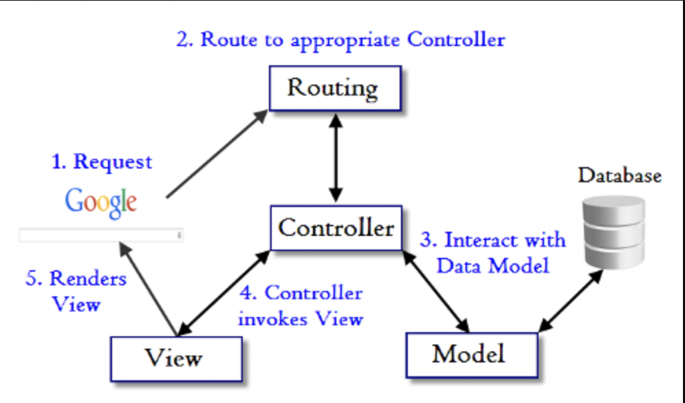
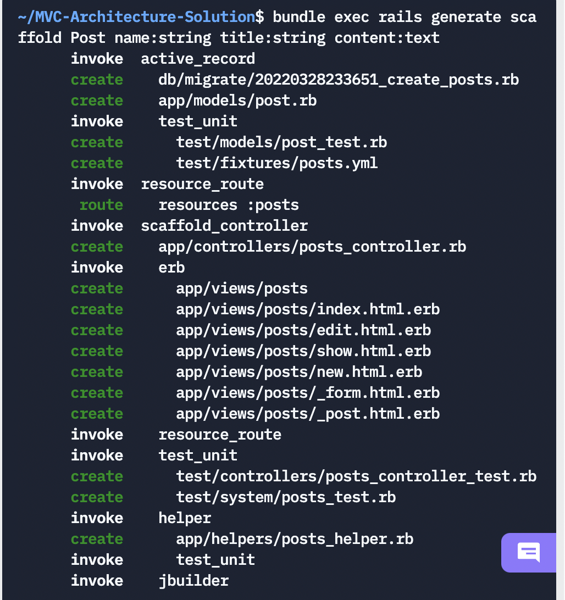
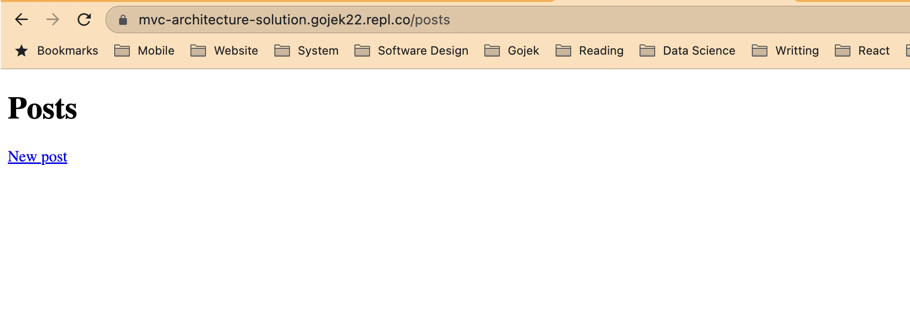
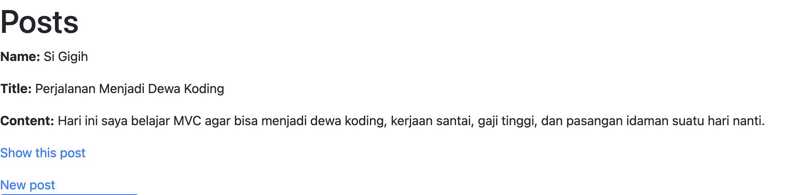
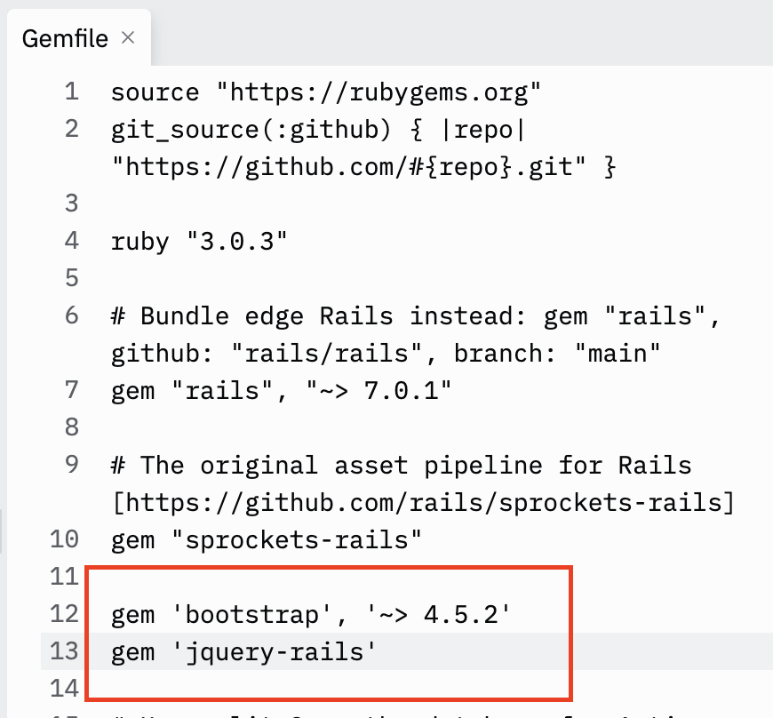
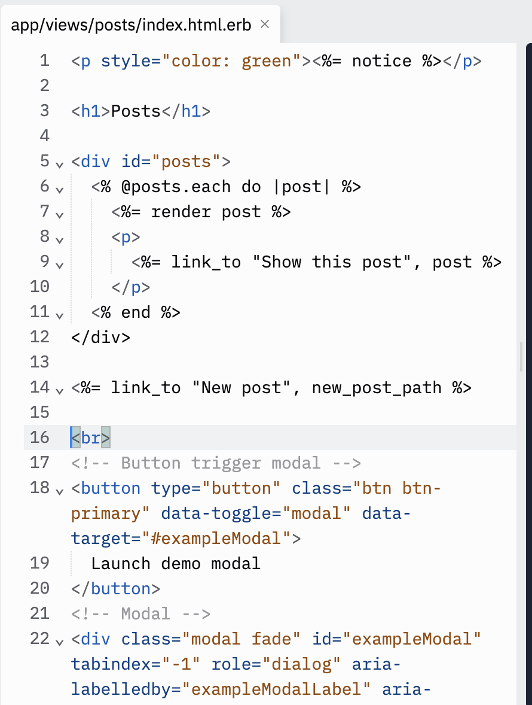
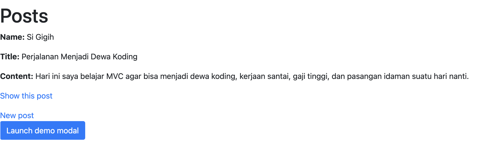
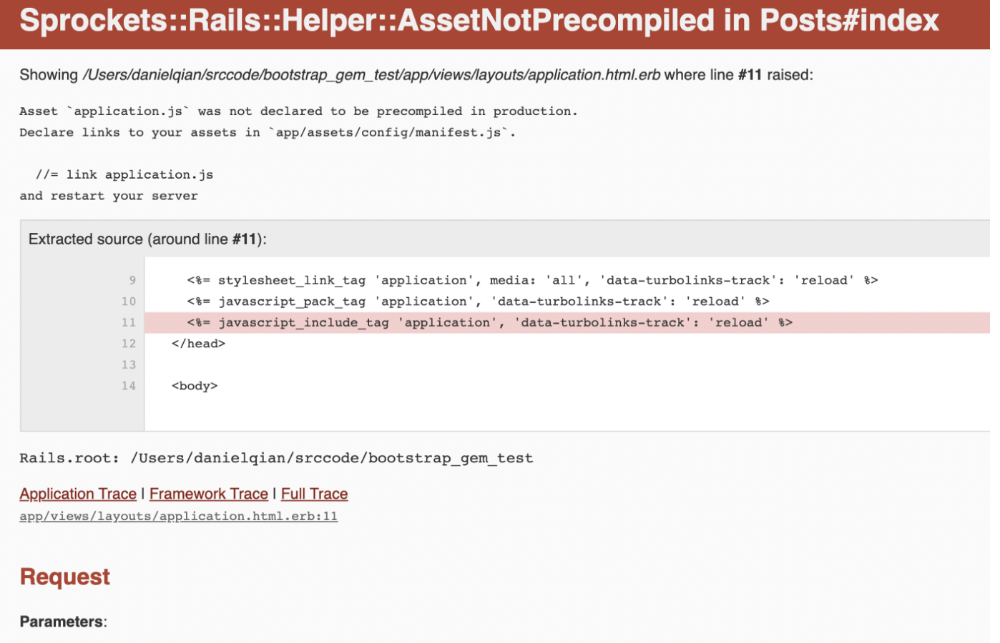
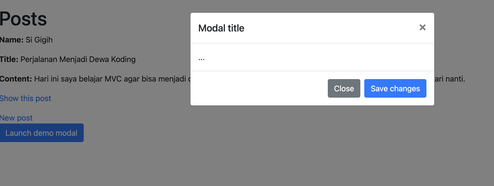
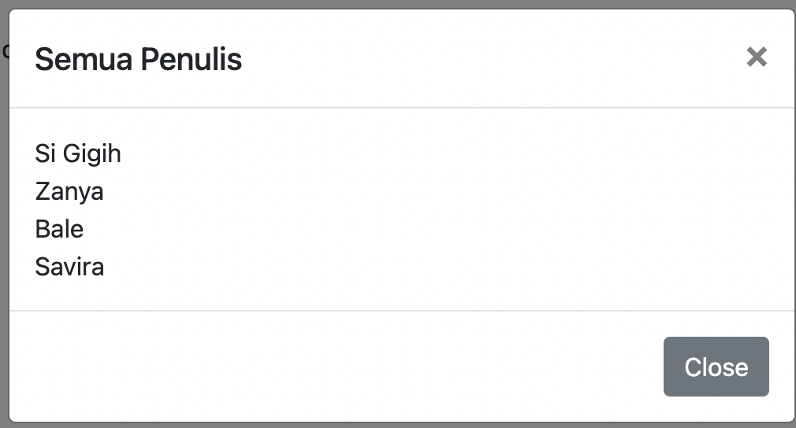

# MVC Architecture
MVC is short of model-view-controller. It is an architecture pattern in development world in how we structure our code. MVC separates application into three parts, which are `model`, `view`, and `controller`. In this section we will learn how to structure our code in MVC related manners.


## Why Should You Use MVC?
Three words: separation of concerns, or SoC for short.

The MVC pattern helps you break up the frontend and backend code into separate components. This way, it's much easier to manage and make changes to either side without them interfering with each other.

But this is easier said than done, especially when several developers need to update, modify, or debug a full-blown application simultaneously.

## Real Life Example of MVC

### Ordering food in restaurant


When we are in a restaurant, we look at the menu to choose the food/beverages we want to order. 

After we decide the food/beverages to order, the waiter/waitress will give our order to the chef.

The chef is the one who prepares our food. After the chef is done with our food, the chef will give the food to waiter/waitress, which is then brought to us.

```
Menu/food → view (the part which consists of user interface)
```

```
Waiter/waitress → controller (the part which coordinates user interface and data)
```

```
Chef → model (the part which manages data)
```

### Model
Model is a component which is responsible for managing the data.

Model is usually consists of data attributes, logic related to the data, and relation between data.

Model handles data modification (like create, read, update, and delete)

Model also deals with business logic related to the data.
Example of business logic related to the data:
- Chef can only handle 3 foods at the same time
- User’s password must be encrypted for security

### View
- View is the component which is responsible for data presentation.
- View is mostly consist of user interface (UI).
For web application, view is usually files which content is mostly HTML and CSS.
- View is the part which user interacted with.

The most common view is web page which is using HTML, Javascript, and CSS. But, view can be also in the form of PDF or email template.

As long as it’s an interface which user interacted with, it is a view.

### Controller
- Controller is the component which coordinates user interface with the data. It is responsible for redirecting the input from user to the data which the user needs to access or use.
- Controller sends command to model to update its state and sends commands to its associated view to change the view's presentation.


In short:


## MVC in Ruby on Rails
Previously, we have used Ruby on Rails to create our simple restaurant apps, congratulations! 🎉

Now, lets dive deeper into the underlying concept of Ruby on Rails Model, View, Controller architecture so we can build a better application.

### Model (ActiveRecords)
In Rails, the ActiveRecords component is acting as a model layer of our application.

In the previous exercise, when you run the command

``` 
$ bundle exec rails generate model item name price
```


It will create an `ActiveRecords file` in the folder `app/models`

It looks like below 
```
class Item < ApplicationRecord
end
```

This means our models can now have a class called Item, where we use it to populate our database, for example in the files `db/seeds.rb` you can see there are
```
Item.create(name: 'Burger', price: '25.000')
Item.create(name: 'Pizza', price: '80.000')
Item.create(name: 'Coke', price: '15.000')
```

which using the `Item class` above, creating the entry in the database.

#### Benefit
Did you noticed that you don't have to write SQL query, since Rails handle that. For some people, reading `Item.create(name: 'Burger', price: '25.000')` is way easier to understand than `INSERT INTO Item(name,price) Values('Burger','25.000')`. Imagine doing this a lot of times. This is also one of the main Ruby benefits that it is `Beautiful`, `Elegant` and `Readable`.

In the official documentation it is called ORM(Object Relational Mapping), it maps the Object you have to the underlying database infrastructure data. This is Ruby way of guiding principle in the Object Oriented Programming(OOP) that everything should be an object.

#### Pro Tip
As you can see in the files

```
class Item < ApplicationRecord
end
```

As we have learned inheritance before, we can know that class Item is inheriting `ApplicationRecord` behaviour. To learn more about `ApplicationRecord` explore [this documentation](https://guides.rubyonrails.org/active_record_basics.html).

### Controller (ApplicationController)



This is the Flow of the controller in the Rails. Notice that the `Controller` is the first entry point of logic for anything instead of the `View`.

Lets look how this work in the code, with the similar inheritance pattern, we can see that the `ItemsController` inherit from `ApplicationController`

```
class ItemController < ApplicationController
   def list
   end
   
   def show
   end
   
   def new
   end
   
   def create
   end
   
   def edit
   end
   
   def update
   end
   
   def delete
   end
end
```

As you can see, it is very easy to connect the `View` to `Models` which contains the data.

For example during list method, we can do something as simple as:

```
class ItemsController < ApplicationController
  def index
    @items = Item.all
  end
end
```

and in the `app/views/items/index.html.erb` we can get the @items.all 

```
<h1> Items </h1>
<table>
  <thead>
    <tr>
        <td><b>Name</b></td>
        <td><b>Price</b></td>
    </tr>
  </thead>
  <tbody>
    <% @items.each do |item| %>
      <tr>
        <td><%= item.name %></td>
        <td><%= item.price %></td>
      </tr>
    <% end %>
  </tbody>
</table>
<a href="/items/new">New Item</a>
```

When the routing goes to the index controller, the `@items.all` that we generate from controller, that reads it from the model getting published in the View.

With this flexibility, we can create a lot of customs application by defining the model, and how we want it to show up in the UI. Then create the controller for them.

#### Pro Tip
Always learn the flow of the application so that it will be easier to debug. For example, if your application not working, you can check in the `router` first, if everything okay then you go step by step as the flow mentioned above. Also, always great to read the [official documentation](https://guides.rubyonrails.org/action_controller_overview.html) to learn about the full feature.

### View 

A Rails View is an `erb` (embedded Ruby) program that shares data with controllers through mutually accessible variables.

If you look in the app/views directory of the library application, you will see one subdirectory for each of the controllers, we have created: items. Each of these subdirectories was created automatically when the `same-named controller` was created with the generate script.


Rails let's you know that you need to create the view file for each new method. Each method you define in the controller needs to have a corresponding erb file, with the same name as the method, to display the data that the method is collecting.

# Hands On Exercise

## Instruction
Since you have mastered the art of Model, View, and Controller. In this section we are going to beautify our project by setting up bootstrap template to it. The tasks is to create a poster where when we open the poster, it will launch a bootstrap modal.

### About Bootstrap
Bootstrap is the most popular styling guide to make your website beautiful. You can check about bootstrap here https://getbootstrap.com/docs/5.1/examples/ 


## Step 1: Create Entity
Previously we are creating the model, view, and controller separately. In ruby there is a generator called `scaffold` that allows to create them all at them same time! So, we can run:

```
$ bundle exec rails generate scaffold Post name:string title:string content:text
```
It should looks like


This will create a model `Post` with three attributes, name, title, and text. It will also create the `controller`, and `views` automatically and also `implemented them`. Next we can run the db creation and migration.

```
$ bundle exec rails db:create db:migrate
```

When you run the replit, it should looks like this:


And if you click on the new posts and added a posts, it has been automatically implemented.




## Step 2: Add bootstrap

Adding bootstrap is as simple as adding to your `Gemfile`. Bootstrap requires jquery so we added jquery too

```
gem 'bootstrap', '~> 4.5.2'
gem 'jquery-rails'
```

You can add this line below the sqlite gems as long as it is on the top. It should looks like



and then we run bundle to add the gems

```
$ bundle
```

Note: It will take some time for the bundle install to complete.

## Step 3: Using SCSS
You might have known about CSS(Cascading Style Sheet), where the language is used to design the HTML to make it prettier. However, there are some limitation to CSS for example, in CSS there is no concept of variable. SCSS solves this by allowing the CSS to have variable and many more extra functionality.

As you can see rails have a css files inside: `app/assets/stylesheets/application.css` to use scss import syntax, we can rename the file to `app/assets/stylesheets/application.scss`

by running the command

```
$ mv app/assets/stylesheets/application.css app/assets/stylesheets/application.scss
```

And then when you open the `app/assets/stylesheets/application.scss` files you will see a lot of comments, but since we don't need them anymore as we are using scss. Remove all the comments and change the file to:

```
@import "bootstrap";
@import "**/*";
```

It should looks like


The first line is to import bootstrap styles from the gem we just installed, the second line is SASS syntax to import every file and folders in the current folder. 

Make sure `@import "bootstrap"` goes on the top so that our style can overwrite the bootstrap default style.


## Step 4: Adding Modal
At the end of the file `app/views/posts/index.html.erb`, add a [bootstrap popup modal](https://getbootstrap.com/docs/4.5/components/modal/).

```
<br>
<!-- Button trigger modal -->
<button type="button" class="btn btn-primary" data-toggle="modal" data-target="#exampleModal">
  Launch demo modal
</button>
<!-- Modal -->
<div class="modal fade" id="exampleModal" tabindex="-1" role="dialog" aria-labelledby="exampleModalLabel" aria-hidden="true">
  <div class="modal-dialog" role="document">
    <div class="modal-content">
      <div class="modal-header">
        <h5 class="modal-title" id="exampleModalLabel">Modal title</h5>
        <button type="button" class="close" data-dismiss="modal" aria-label="Close">
          <span aria-hidden="true">&times;</span>
        </button>
      </div>
      <div class="modal-body">
        ...
      </div>
      <div class="modal-footer">
        <button type="button" class="btn btn-secondary" data-dismiss="modal">Close</button>
        <button type="button" class="btn btn-primary">Save changes</button>
      </div>
    </div>
  </div>
</div>
```


It should looks like



Run the rails server and go to the `/post`
it should looks like this




we can see the bootstrap style is already imported, but try to click the button, nothing happens. Next, we need to import bootstrap javascript.

## Step 5: Import Javascript
When we open our webpage on `app/views/layouts/application.html.erb`. We can see that the javascript is imported automatically.

It is shown in this line of code

```
<%= javascript_pack_tag 'application', 'data-turbolinks-track': 'reload' %>
```

Now, lets link our javscript by creating a folder `javascript` inside the `app/assets` folder 

```
$ mkdir app/assets/javascript
```

And then, we can create a new file
`app/assets/javascript/application.js`
and add below lines

```
//= require jquery3
//= require popper
//= require bootstrap-sprockets
```

Next we need to include it to our application layout by add this line at the end of `<head>` tag in `app/views/layouts/application.html.erb`

```
<%= javascript_include_tag 'application', 'data-turbolinks-track': 'reload' %>
```

The lines looks like


Now let’s re-run the page.

We will find these errors:


We can fix this error by following the instruction on the error message, by adding `//= link application.js` to the `app/assets/config/manifest.js` , it will look like this

```
//= link application.js
//= link_tree ../images
//= link_directory ../stylesheets .css
```

Now, lets re-run the page


And here we go, we have added bootstrap and javascript to our app.

Congratulations 🎉

# Homework

## Add all writers name to the modal
Print all writer name inside the modal when clicked, for example:



## Change the colour of the headings
Use your favourite colour or any bootstrap colour for the headings


## Make the table looks pretty
Currently, the table looks not aligned, you can use your refference from previous homework and this homework to make the table looks pretty.

Refference:
- https://getbootstrap.com/docs/4.1/content/tables/
