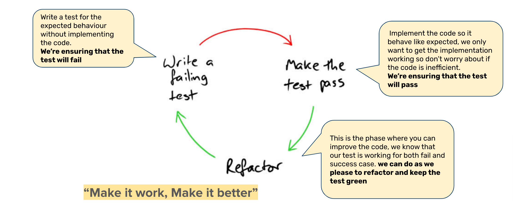
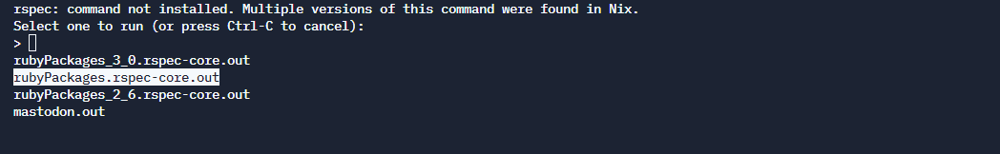

# Unit Tests and TDD

Let us consider a software developer named Alice. Alice is working on a project which invloves creating 3 programs namely A, B, and C.

- Day 1: Alice creates program A, runs the program, verifies if A is behaving as expected and then deploy it to production.
- Day 2: Alice creates program B and like the previous day verifies *just* the program B and deploys it to production.
- Day 3: Similar to the previous days Alice creates a program C, verifies *just* the program C and deploys it to production.

Is Alice forgetting something?

If you had guessed, "yes, she should have tested previos programs before deploying new ones", then you are right (Don't foget to pat you on your back if you guessed it right 🤘)

That small mistake of Alice could have been cause of lots of Bugs 😱.

You definitely don't want to be like Alice.

### How To prevent this?

You need to test all the features before releasing it to production. But what if instead of just A, B and C you have 100 more programs. **Shall we all test those manually?** The answer is No! This is where automated comes to the rescue.

## Automated test

An automated test is a seperate program that executes components of your main prerogram and verifies they behave as expected. Automated tests is what *Alice* needs to verify behaviour and old feature behaviour.

Automated tests will save a lot of time since it allows you to test the program behaviour without any manual intervention. It is like a code checking your code from top to bottom. Isn't that exciting? 😎

### Types of Automated tests

- Unit tests: test individual components of your program, usually methods or functions.
- Integration tests: test your entire program, to ensure that all its methods, classes and other components integrate successfully.
- Performance tests: messsure the speed of execution of your program.

## Unit Tests

As mentioned earlier __Unit Tests__ test inidivual units of your programs, which usually are your methods or functions.

### What is a unit?

You might be thinking what is a unit, so a __unit__ of code is an isolated collections of code, it can be tested without loading or running the entire application.

### What is a test?

**Test or test case** consists of a set of inputs, one or more function calls, and an assertion about the expected output. So basically *Unit Test* is an assertion about a unit of code that can be verified.

## F.I.R.S.T Principle
When eriting unit tests for your code., you should keep in mind the following principles: 

- **F**ast: write test that is simplae and can run fast.
- **I**ndependent/Isolated: write test that should not depend on other test cases.
- **R**epeatable: write test that can run multiple times in any environment and still produce the same result.
- **S**elf-validating: write test that have no manual validation need after running test.
- **T**imely/Thorough:
  - Timely: Write before implementing your code(TDD approach)
  - Thorough: Write test for many cases, where we can trust the Unit test to verify the implementation thoroughly.

## Test Driven Development

Test driven development is a practice in which we write a test before we write any code. It is known for its unique workflow called the red-green-refactor cycle.



### Red Stage - Write a failing test

Write a test for the expected behaviour without implementing the code. Here we ensure that all the tests will fail.

### Green Stage - Make the test pass

Implement the code so it behaves as expected, we only want to get the implementation working so we need not worry about the efficiency of the code. Here we ensure that the tests will pass.

### Refactor Stage

This is the phase where you can improve the code, we know that our test is working for both fail and success case. Here we can refactor our code as we please as long as we keep the tests green.

# Hands-On: TDD in Ruby with RSpec

**[Note]** You are expected to try this hands-on experience before the classroom session. In the classroom session, instructor will dedicate a large portion of the session to walk through this hands-on part together with everyone in the classroom.

**RSpec** is a testing framework for Ruby. This will be out testing tool for this module.

## Command-Line Wordle

For our hands-on exercise, we are going to create a simple command-line based Wordle game. The result of this exercise will look like this:

```
Your guess:
ALIVE
🟦🟦🟦🟦🟨
Your guess:
DREAM
🟨🟦🟩🟦🟦
Your guess:
BREAD
🟦🟦🟩🟦🟩
Your guess:
BREED
🟦🟦🟩🟩🟩
Your guess:
SPEED
🟩🟩🟩🟩🟩
```

Interesting isn't it? Let's do this!

### Your First Spec

To use RSpec in Replit, run command `rspec --version` in Replit console. When given the following choice, select the second one (`rubyPackages.rspec-core.out`):



Then, execute the following commands in Replit console or shell:

```ruby
gem install rspec-expectations --version 3.10.2
gem install rspec-mocks --version 3.10.2
```

Once we have confirmed RSpec is there, let's start initializing RSpec in your working directory. To do this, run `rspec --init`. It should create an `.rspec` file and a spec directory `spec/spec_helper.rb`. Next, let's write our first test.

If this is the first time you are doing TDD, you might be a little bit confused and think, "how do I write a test when the code is not there yet?" If you feel that way, don't worry, it's very normal. In fact, we do think that the term "TDD" is a little bit of a misnomer. Instead of testing something, what we are going to do is actually specifying behaviors of our program.

What is the simplest behavior of our program that you can think of?

How about, specifying a class, let's call it `Game` that has an attribute called `secret_word` and a behavior called `match_word` that accepts a `guess_word` to be compared with `secret_word`. In TDD, we want to start with the simplest scenario. One simple scenario we can think of is if user input all incorrect letters, `match_words` should return 🟦🟦🟦🟦🟦.

```ruby
require 'game'

describe 'Game' do
  describe '#match_word' do
    it 'should handle all incorrect letters well' do
      game = Game.new('DRINK')
      guess_word = 'HELLO'

      result = game.match_word(guess_word)

      expect(result).to eq("\u{1F7E6}\u{1F7E6}\u{1F7E6}\u{1F7E6}\u{1F7E6}")
    end
  end
end
```

Save the file above in `spec/game_spec.rb`. Run `rspec -fd` from the root directory of your project. You should see an error message like the following:

```
Failure/Error: require 'game'

LoadError:
  cannot load such file -- game
# ./spec/game_spec.rb:1:in `<top (required)>'
No examples found.

Finished in 0.00003 seconds (files took 0.07481 seconds to load)
0 examples, 0 failures, 1 error occurred outside of examples
```

Don't worry, this is indeed what we should expect. This the red phase in red-green-refactor cycle. Now, let's write just enough code to make our test pass. Write the following in `lib/game.rb`

```ruby
class Game
  def initialize(secret_word)
  end

  def match_word(guess_word)
    "\u{1F7E6}\u{1F7E6}\u{1F7E6}\u{1F7E6}\u{1F7E6}"
  end
end
```

If you run `rspec -fd` again, now you'll see the following message:

```
Game
  #match_word
    should handle all incorrect letters well

Finished in 0.00129 seconds (files took 0.07469 seconds to load)
1 example, 0 failures
```

Our test has passed. But you might be curious, what happened there? To better understand what just happened, take a look at the comments in the following snippet:

```ruby
require 'game'

# The outer block called a spec group
# This is where we specify what we want to build, in this case a Game class
describe 'Game' do

  # This inner block is another spec group
  # The convention is to use #name_of_method to define group of specs for a behavior
  describe '#match_word' do

    # The most inner block specifies a scenario
    # In this case, we are specifying that 
    # when given all incorrect letters as guess_word,
    # match_word will return "\u{1F7E6}\u{1F7E6}\u{1F7E6}\u{1F7E6}\u{1F7E6}"
    # which is the ASCII code for 🟦🟦🟦🟦🟦
    it 'should handle all incorrect letters well' do
      # The following spec structure is known as given-when-then

      # Given we have a game object with secret_word 'DRINK'
      # and guess_word is 'HELLO'
      game = Game.new('DRINK')
      guess_word = 'HELLO'

      # When we try to match the guess_word with secret word using match_word method
      result = game.match_word(guess_word)

      # Then it should return 🟦🟦🟦🟦🟦
      expect(result).to eq("\u{1F7E6}\u{1F7E6}\u{1F7E6}\u{1F7E6}\u{1F7E6}")
    end
  end
end
```

As for the code implementation to make our spec pass, here's the explanation:

```ruby
# At this point in time, we only write the necessary code to make our spec pass
class Game
  def initialize(secret_word)
  end

  # Because we only handle all incorrect letters,
  # for now just immediately return "\u{1F7E6}\u{1F7E6}\u{1F7E6}\u{1F7E6}\u{1F7E6}"
  # which is the ASCII code for 🟦🟦🟦🟦🟦
  def match_word(guess_word)
    "\u{1F7E6}\u{1F7E6}\u{1F7E6}\u{1F7E6}\u{1F7E6}"
  end
end
```

### What's Next?

Then, what spec should we write next? Can you think of the next simplest scenario for `match_word` method? What about returning 🟨 for a letter that is in incorrect position?

```ruby
require 'game'

describe 'Game' do
  describe '#match_word' do
    it 'should handle all incorrect letters well' do
      game = Game.new('DRINK')
      guess_word = 'HELLO'

      result = game.match_word(guess_word)

      expect(result).to eq("\u{1F7E6}\u{1F7E6}\u{1F7E6}\u{1F7E6}\u{1F7E6}")
    end

    # One additional spec for new scenario: wrongly positioned letter
    it 'should handle a wrongly positioned letter well' do
      # Given a game object with secret_word 'DRINK'
      # and guess_word 'CLEAN' (N is a correct letter but in wrong position)
      game = Game.new('DRINK')
      guess_word = 'CLEAN'

      # When we try to match the guess word
      result = game.match_word(guess_word)

      # Then it should return "\u{1F7E6}\u{1F7E6}\u{1F7E6}\u{1F7E6}\u{1F7E8}"
      # which is the ASCII code for 🟦🟦🟦🟦🟨
      expect(result).to eq("\u{1F7E6}\u{1F7E6}\u{1F7E6}\u{1F7E6}\u{1F7E8}")
    end
  end
end
```

If we run `rspec -fd` now, we will get the following result:

```
Game
  #match_word
    should handle all incorrect letters well
    should handle a wrongly positioned letter well (FAILED - 1)

Failures:

  1) Game #match_word should handle a wrongly positioned letter well
     Failure/Error: expect(result).to eq("\u{1F7E6}\u{1F7E6}\u{1F7E6}\u{1F7E6}\u{1F7E8}")

       expected: "🟦🟦🟦🟦🟨"
            got: "🟦🟦🟦🟦🟦"

       (compared using ==)
     # ./spec/game_spec.rb:20:in `block (3 levels) in <top (required)>'

Finished in 0.0109 seconds (files took 0.08284 seconds to load)
2 examples, 1 failure

Failed examples:

rspec ./spec/game_spec.rb:14 # Game #match_word should handle a wrongly positioned letter well
```

Let's make our new spec pass.

```ruby
class Game
  # Now it's necessary to assign secret_word to @secret_word
  def initialize(secret_word)
    @secret_word = secret_word
  end

  def match_word(guess_word)
    result = "\u{1F7E6}\u{1F7E6}\u{1F7E6}\u{1F7E6}\u{1F7E6}"

    # Now it's necessary to properly handle a correct letter in incorrect position
    guess_word.split('').each_with_index do |letter, index|
      if @secret_word.include?(letter)
        # "\u{1F7E8}" is the ASCII code for 🟨
        result[index] = "\u{1F7E8}"
      end
    end
    
    result
  end
end
```

When you run `rspec -fd`, now you should see:

```
Game
  #match_word
    should handle all incorrect letters well
    should handle a wrongly positioned letter well

Finished in 0.00135 seconds (files took 0.0784 seconds to load)
2 examples, 0 failures
```

### Complete The Spec

We are almost at the end of our Wordle implementation. What do you think the next scenario that we should specify? If you thought of handling correct letter in correct position, you're correct! Let's write the spec for that:

```ruby
require 'game'

describe 'Game' do
  describe '#match_word' do
    it 'should handle all incorrect letters well' do
      game = Game.new('DRINK')
      guess_word = 'HELLO'

      result = game.match_word(guess_word)

      expect(result).to eq("\u{1F7E6}\u{1F7E6}\u{1F7E6}\u{1F7E6}\u{1F7E6}")
    end

    it 'should handle a wrongly positioned letter well' do
      game = Game.new('DRINK')
      guess_word = 'CLEAN'

      result = game.match_word(guess_word)

      expect(result).to eq("\u{1F7E6}\u{1F7E6}\u{1F7E6}\u{1F7E6}\u{1F7E8}")
    end

    # This is our new spec.
    # By now you should have already understood the structure of this spec
    it 'should handle a correctly positioned letter well' do
      game = Game.new('DRINK')
      guess_word = 'ALIVE'

      result = game.match_word(guess_word)

      expect(result).to eq("\u{1F7E6}\u{1F7E6}\u{1F7E9}\u{1F7E6}\u{1F7E6}")
    end
  end
end
```

As usual, run `rspec -fd` to ensure we get the red phase first.

```
Game
  #match_word
    should handle all incorrect letters well
    should handle a wrongly positioned letter well
    should handle a correctly positioned letter well (FAILED - 1)

Failures:

  1) Game #match_word should handle a correctly positioned letter well
     Failure/Error: expect(result).to eq("\u{1F7E6}\u{1F7E6}\u{1F7E9}\u{1F7E6}\u{1F7E6}")

       expected: "🟦🟦🟩🟦🟦"
            got: "🟦🟦🟨🟦🟦"

       (compared using ==)
     # ./spec/game_spec.rb:29:in `block (3 levels) in <top (required)>'

Finished in 0.01282 seconds (files took 0.08151 seconds to load)
3 examples, 1 failure

Failed examples:

rspec ./spec/game_spec.rb:23 # Game #match_word should handle a correctly positioned letter well
```

And of course, write the implementation to make our spec pass.

```ruby
class Game
  def initialize(secret_word)
    @secret_word = secret_word
  end

  def match_word(guess_word)
    result = "\u{1F7E6}\u{1F7E6}\u{1F7E6}\u{1F7E6}\u{1F7E6}"

    guess_word.split('').each_with_index do |letter, index|
      if @secret_word[index] == letter
        result[index] = "\u{1F7E9}"
      elsif @secret_word.include?(letter)
        result[index] = "\u{1F7E8}"
      end
    end
    
    result
  end
end
```

We finally get all our specs pass and all possible scenarios covered:

```
Game
  #match_word
    should handle all incorrect letters well
    should handle a wrongly positioned letter well
    should handle a correctly positioned letter well

Finished in 0.00231 seconds (files took 0.08552 seconds to load)
3 examples, 0 failures
```

By now, you might be thinking, "is that all? Really? Just those three scenarios?"

Well, probably there are other scenarios like, "what if user input numbers instead of letters?" In a full-fledged production grade software, you should think of those edge cases. This is why in software engineering, **writing tests and doing TDD do not make your software 100% bug free, it makes your software behave predictably for the scenarios/cases that you can think of!**

Trying to figure out what scenarios that can occur and how to handle them is something that you'll need to gain with real world experience. For now though, the core scenarios of our Wordle should be enough.

People say seeing is believing. To really see our Wordle implementation in action, write the following in your `main.rb` and try to play with it on your own:

```ruby
require_relative 'lib/game'

game = Game.new('SPEED')

loop do
  puts 'Your guess:'
  guess_word = gets.chomp()
  result = game.match_word(guess_word)
  puts result
  break if result == "\u{1F7E9}\u{1F7E9}\u{1F7E9}\u{1F7E9}\u{1F7E9}"
end
```

# Homework

**[Note]** You are not expected to finish this homework section before the classroom session starts, you are expected to submit this homework section one day after the classroom session.

For your homework, try to add one more spec to ensure that user can only input actual word instead of random letters such as "ABCDE". If user inputs random letter, `match_word` should return "Not an English word". 

**[Note]** To check if a word is an actual English word or not, you can call the following API:

```
https://api.dictionaryapi.dev/api/v2/entries/en/<word>
```

Example:

```
https://api.dictionaryapi.dev/api/v2/entries/en/hello
```
